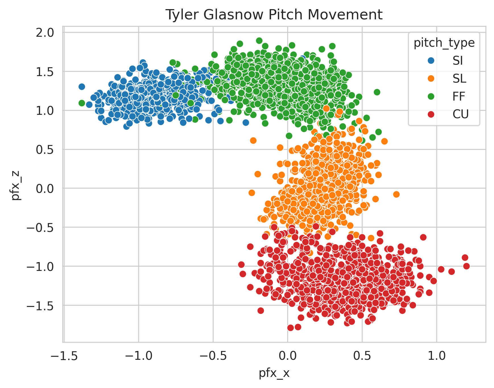
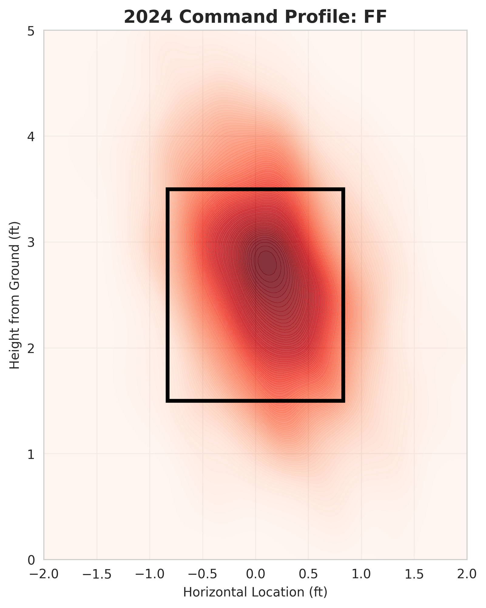

# MLB Pitcher Scouting & Automation Pipeline

### **Overview**
This project automates the collection and analysis of Statcast data to support Baseball Operations and Coaching staff. It demonstrates an end-to-end workflow: fetching raw data, managing it via SQL, and generating actionable visualizations for game planning.

---

### **Key Features**
* **Automated Data Ingestion:** Uses `pybaseball` to fetch real-time Statcast data.
* **SQL Integration:** Simulates a professional Baseball Ops environment by warehousing data in a local SQLite database for efficient querying.
* **Performance Metrics:** Calculates advanced metrics such as **Whiff%** per pitch type and velocity differentials.
* **Strategic Visualization:** Includes Pitch Movement profiles and Strike Zone heatmaps to identify pitcher trends and "tunneling" opportunities.

### **Strategic Analysis of Visuals**

* **Pitch Tunneling:** The movement plot shows that the Fastball and Slider share a similar initial trajectory before diverging, which is a key metric for inducing swings-and-misses.
* **Targeted Command:** The heatmap reveals a high concentration of fastballs at the top of the zone, a tactic frequently used by the Dodgers to exploit high-spin-rate "rise" and generate pop-ups.

  
  

---

### **How to Use**
1.  **Open in Colab:** Click the "Open in Colab" button inside the `.ipynb` file to run the analysis.
2.  **SQL Queries:** The notebook includes SQL blocks to demonstrate how to pull specific pitcher trends from the database.
3.  **Requirements:** All dependencies are listed in `requirements.txt`.

---

### **Business Impact (Baseball Ops Context)**
This tool reduces the manual workload for analysts by automating the "Pre-Game" data pull. It allows coaches to quickly see which pitches have the highest swing-and-miss probability and where a pitcher is most likely to locate them in critical counts.
